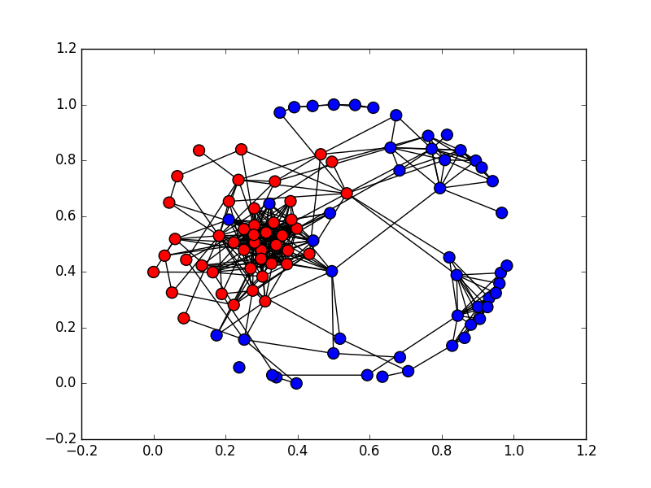
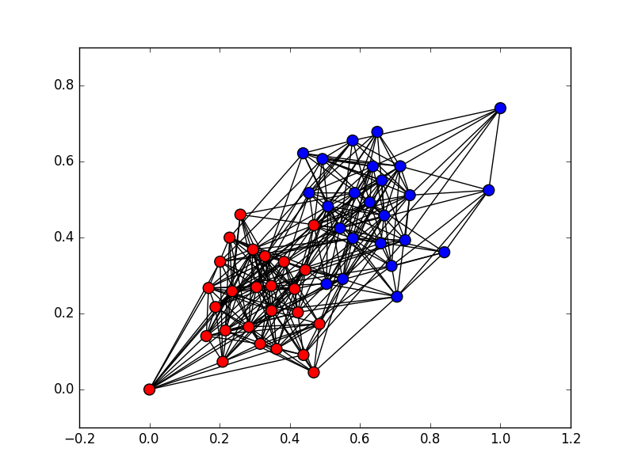

# Example of semidefinite programming relaxation: Community Detection

## Introduction

This repository contains (rough) Python code to detect communities in network data via semidefinite programming relaxations.

* `commdet.py`: contains code to detect communities and plot the network given an adjacency matrix as input
* `toytest.py`: a test for a toy network, the Stochastic Block Model with two (equally sized) communities
* `twittest.py`: a test for communities within a Twitter (ego) network

## Requirements

Required Python libraries include:

    cvxopt
    numpy
    networkx
    matplotlib

For any questions, bug reports, etc., contact [Steven S. Kim](http://ssk.im) via e-mail at [steven_kim@brown.edu](mailto:steven_kim@brown.edu).

## Project Notes and TODOs

* We should test code on a "natural" subset of network data, rather than the inherently biased sample given by an ego-network.
* Should compare to modern belief propagation / non-backtrack matrix methods.
* Explore the cutting edge: multiple communities, overlapping communities, incorporating feature data.
